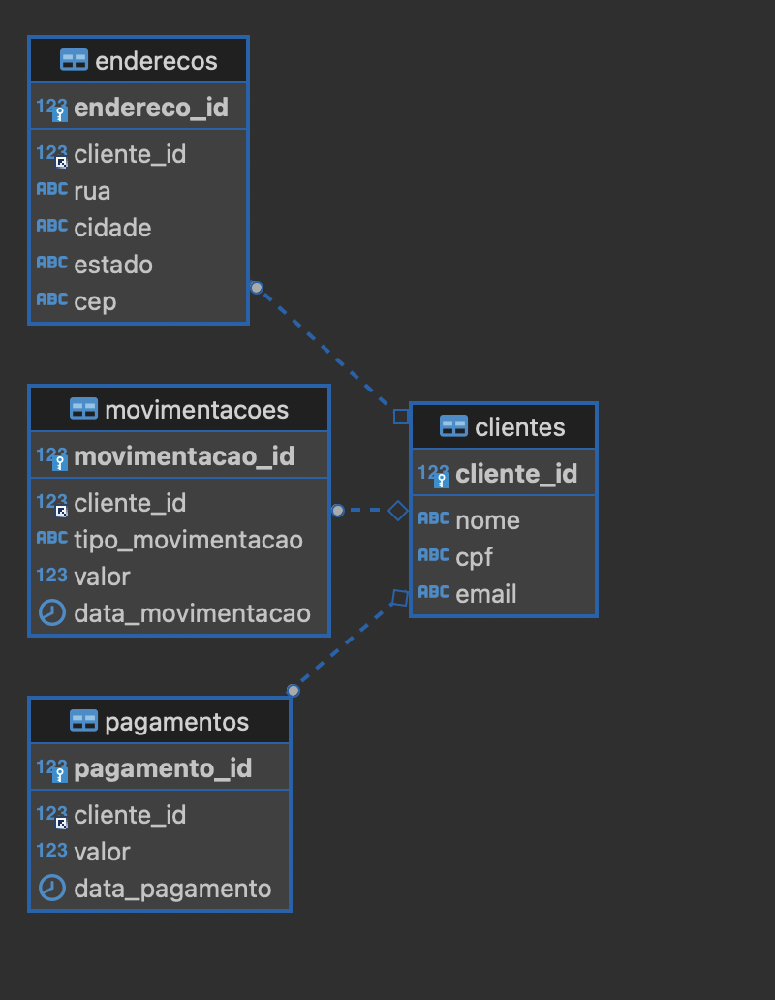

<h1 align="center">


<h3> <p align="center">Massa de Dados Fictícia - DIOBANK </p> </h3>
<h3> <p align="center"> ================= </p> </h3>


## **Project Overview**

In this section, we created a script capable of generating a fictional data set for the mock bank DioBank. The purpose is to generate CSV files and also insert the data into a locally configured MySQL database. This script was developed as part of a hands-on course on the DIO.me platform (https://www.dio.me/en). The project simulates a financial institution where you'll interact with a MySQL database using SQL commands.


## **Prerequisites**

1. Install the packages listed in requirements.txt.
2. Install and run a MySQL database on your local machine.
3. Configure access credentials in the .env file.


### **Project Objective**

The goal of this project is to generate, manipulate, and query fictional data simulating bank operations. It was developed as part of the course "AI Agents for SQL Queries," where students have the opportunity to understand how queries work in relational databases, using MySQL to manage a customer database, addresses, payments, and financial transactions.

## **Project Structure**

This project is structured around a fictional database containing the following main entities:

1. Clients – Table that stores information about bank clients, such as name, CPF (Brazilian ID), and email.
2. Addresses – Relates clients to their physical addresses, including street, city, state, and ZIP code.
3. Bank Transactions – Table that records financial transactions made by clients (withdrawals, deposits, transfers).
4. Payments – Records payments made by clients, including amount and payment date.

### **Table Relationships**



The tables have the following relationships:
- Clients ↔ Addresses: The addresses table is linked to the clients table through the cliente_id field.
- Clients ↔ Bank Transactions: The transactions table is also related to the clients table through the cliente_id field, representing the clients’ financial movements.
- Clients ↔ Payments: The payments table is related to the clients table using the cliente_id field, representing payments made by clients.

These tables are interconnected through foreign keys that ensure data referential integrity, making joins in SQL queries easier to perform.

## **Example of Table Structure**

```sql
CREATE TABLE clientes (
    cliente_id INT AUTO_INCREMENT PRIMARY KEY,
    nome VARCHAR(100),
    cpf VARCHAR(11),
    email VARCHAR(100)
);

CREATE TABLE enderecos (
    endereco_id INT AUTO_INCREMENT PRIMARY KEY,
    cliente_id INT,
    rua VARCHAR(255),
    cidade VARCHAR(100),
    estado VARCHAR(50),
    cep VARCHAR(8),
    FOREIGN KEY (cliente_id) REFERENCES clientes(cliente_id)
);

CREATE TABLE movimentacoes (
    movimentacao_id INT AUTO_INCREMENT PRIMARY KEY,
    cliente_id INT,
    tipo_movimentacao VARCHAR(50),
    valor DECIMAL(10, 2),
    data_movimentacao DATE,
    FOREIGN KEY (cliente_id) REFERENCES clientes(cliente_id)
);

CREATE TABLE pagamentos (
    pagamento_id INT AUTO_INCREMENT PRIMARY KEY,
    cliente_id INT,
    valor DECIMAL(10, 2),
    data_pagamento DATE,
    FOREIGN KEY (cliente_id) REFERENCES clientes(cliente_id)
);