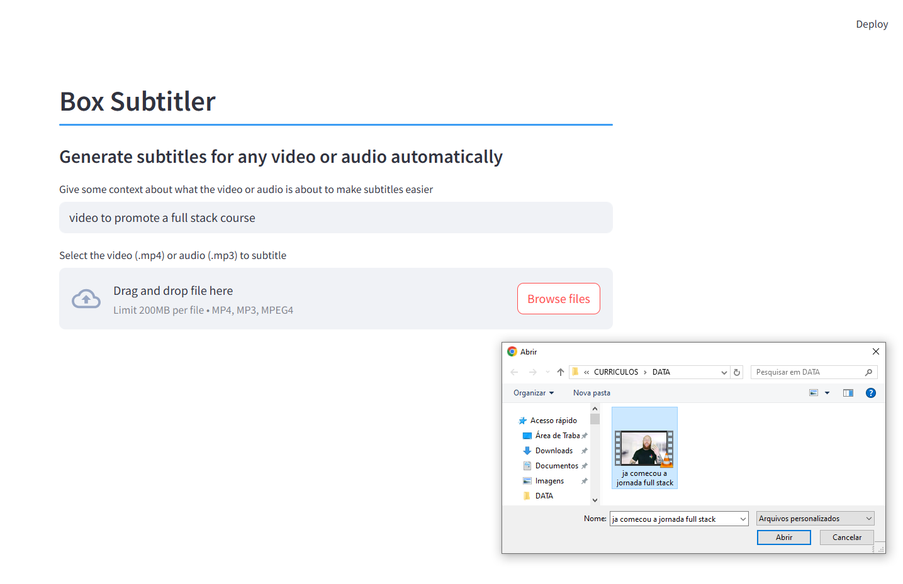

# 🎬 Box Subtitler

Automatically generate subtitles for any video or audio file using OpenAI Whisper.  
Simple and intuitive web interface built with Streamlit.


---

## 🚀 How to Use

### 1. Install dependencies

```bash
pip install -r requirements.txt
```

### 2. Set up your OpenAI API key

Create a folder (if it doesn't exist) and a file named `.env` in the root directory of your project.

Inside the `.env` file, add the following line, replacing the value with your actual OpenAI API key:

```
OPENAI_API_KEY=your_openai_key_here
```

### 3. Run the app

Launch the Streamlit app with the following command:

```bash
streamlit run main.py
```

## 📂 What It Does

- Extracts audio from `.mp4` video files or uses `.mp3` files directly
- Converts the audio to `.mp3` format (if necessary)
- Sends the audio to OpenAI's Whisper model for transcription
- Generates a subtitle file in `.srt` format
- Displays the result in a clean Streamlit interface

---

## 🧠 Optional: Add Context

To improve transcription accuracy, you can provide a short description of what the audio is about.  
This helps Whisper understand the domain or tone of the content.

**Example:**  
> "A motivational talk about switching careers to tech."

---

## 📥 Input

- A video or audio file (`.mp4` or `.mp3`)
- (Optional) A context prompt to guide the transcription


## 📤 Output

- `audio.mp3` – converted audio file (if needed)
- `subtitle.srt` – generated subtitle file in SRT format


---

## 🛠️ Built With

- [Python](https://www.python.org/)
- [OpenAI Whisper API](https://platform.openai.com/docs/guides/speech-to-text)
- [Streamlit](https://streamlit.io/)
- [Pydub](https://github.com/jiaaro/pydub)
- [python-dotenv](https://github.com/theskumar/python-dotenv)

---

